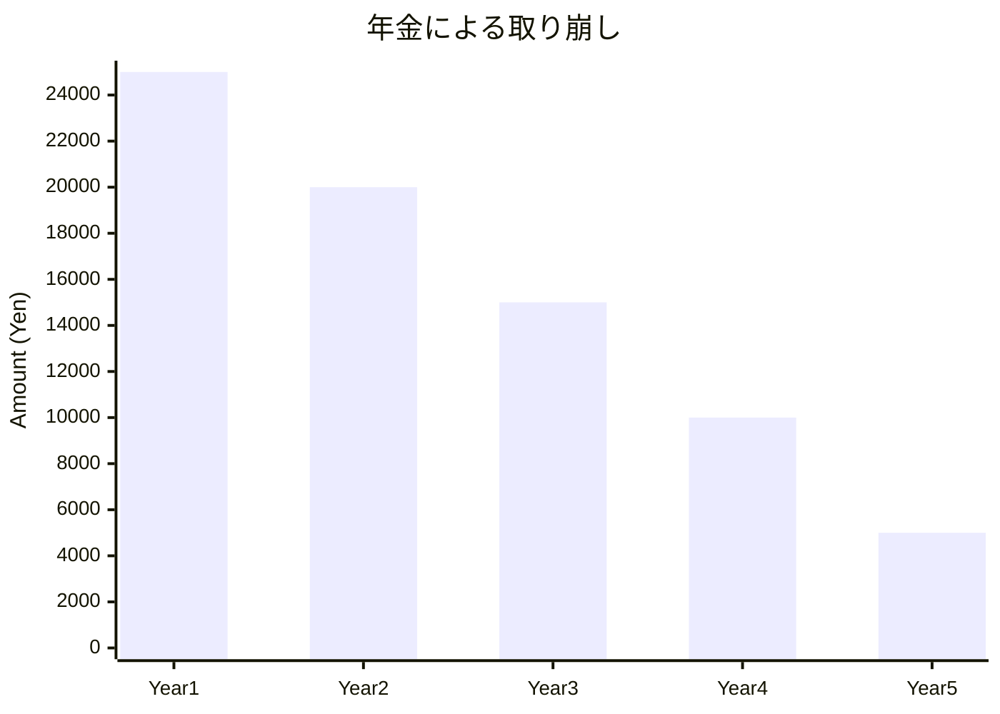

年金をもらうための原価を求める

$元本 =　目標額年金 × 年金現価係数$

[[年金現価係数]]= 1 / [[資本回収係数]]

```mermaid
xychart-beta
    title "年金による取り崩し"
    x-axis [Year1, Year2, Year3, Year4, Year5]
    y-axis "Amount (Yen)" 0 --> 25000
    bar [25000, 20000, 15000, 10000, 5000]
```