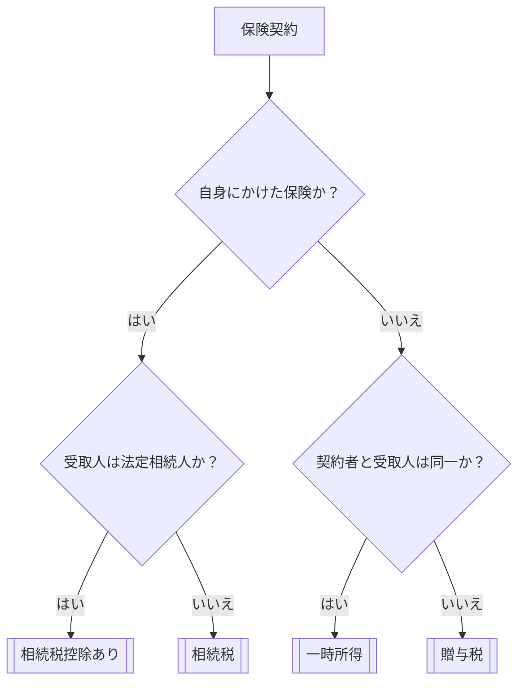

以下の分類に従って課税される

- 契約者と被保険者が同一
	- 受取人が法定相続人⋯[[相続税]](控除あり)[^1]
	- 受取人が法定相続人以外⋯[[相続税]]
- 契約者と被保険者が非同一
	- 契約者と受取人が同一⋯[[一時所得]]による[[所得税]]
	- 契約者と受取人が非同一⋯[[贈与税]]

[^1]: 1人あたり500万円まで控除

```mermaid
flowchart TD

A[保険契約] --> B{自身にかけた保険か？}

  

B -->|はい| C{受取人は法定相続人か？}

C -->|はい| D[[相続税控除あり]]

C -->|いいえ| E[[相続税]]

  

B -->|いいえ| F{契約者と受取人は同一か？}

F -->|はい| G[[一時所得]]

F -->|いいえ| H[[贈与税]]
```