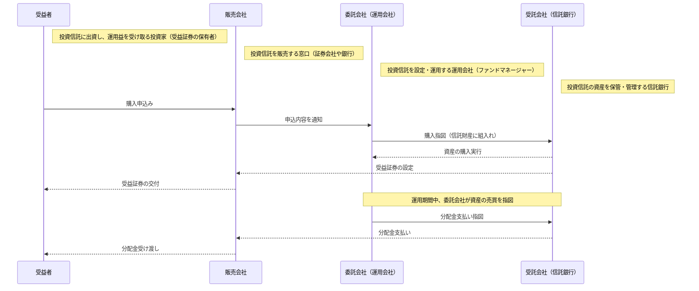

##### 【発行証券】
受益証券

##### 【投資家】
受益者

##### 【運用対象】
- [[証券投資信託]]
- 有価証券以外（不動産など）

```mermaid
sequenceDiagram
    participant 受益者 as 受益者
    participant 販売会社 as 販売会社
    participant 委託会社 as 委託会社（運用会社）
    participant 受託会社 as 受託会社（信託銀行）

    note right of 受益者: 投資信託に出資し、運用益を受け取る投資家（受益証券の保有者）
    note right of 販売会社: 投資信託を販売する窓口（証券会社や銀行）
    note right of 委託会社: 投資信託を設定・運用する運用会社（ファンドマネージャー）
    note right of 受託会社: 投資信託の資産を保管・管理する信託銀行

    受益者->>販売会社: 購入申込み
    販売会社->>委託会社: 申込内容を通知
    委託会社->>受託会社: 購入指図（信託財産に組入れ）
    受託会社-->>委託会社: 資産の購入実行
    受託会社-->>販売会社: 受益証券の設定
    販売会社-->>受益者: 受益証券の交付

    Note over 受託会社,委託会社: 運用期間中、委託会社が資産の売買を指図

    委託会社->>受託会社: 分配金支払い指図
    受託会社-->>販売会社: 分配金支払い
    販売会社-->>受益者: 分配金受け渡し

```

