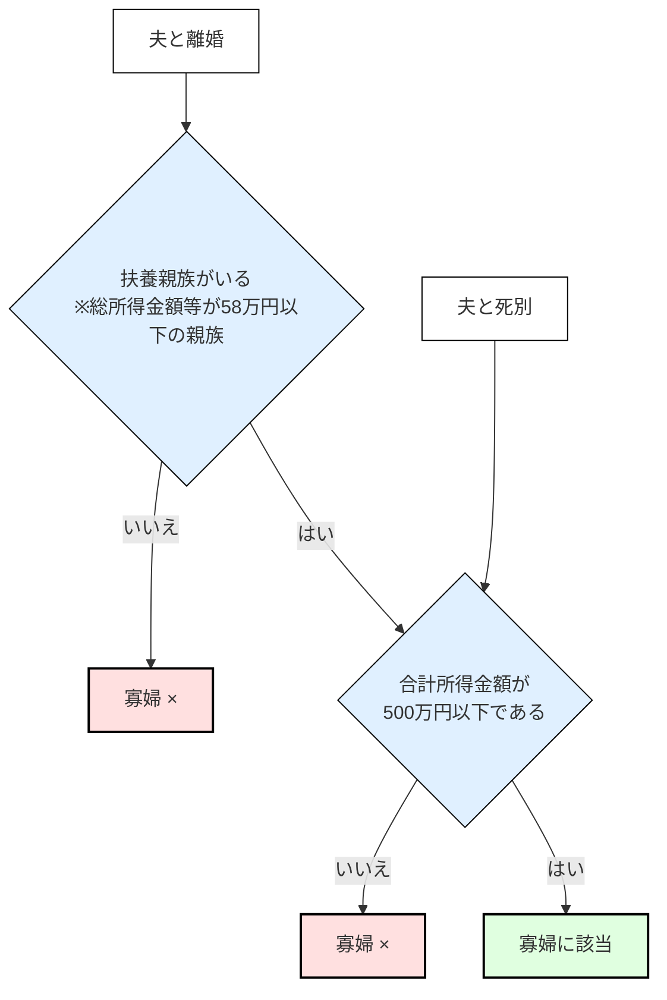

以下の条件に該当する場合、所得から==27万円==控除される

- 夫と離婚した後、未婚で扶養家族がいる
- 夫と死別後、未婚
- 合計所得金額が500万円以下

```mermaid
flowchart TD
    A[夫と離婚] --> B{扶養親族がいる<br>※総所得金額等が58万円以下の親族}
    B -- いいえ --> X1[寡婦 ×]
    B -- はい --> C{合計所得金額が<br>500万円以下である}
    C -- いいえ --> X2[寡婦 ×]
    C -- はい --> Y1[寡婦に該当]

    D[夫と死別] --> C

    style A fill:#ffffff,stroke:#000,stroke-width:1px
    style D fill:#ffffff,stroke:#000,stroke-width:1px
    style B fill:#e0f0ff,stroke:#000,stroke-width:1px
    style C fill:#e0f0ff,stroke:#000,stroke-width:1px
    style Y1 fill:#e0ffe0,stroke:#000,stroke-width:2px
    style X1 fill:#ffe0e0,stroke:#000,stroke-width:2px
    style X2 fill:#ffe0e0,stroke:#000,stroke-width:2px

```