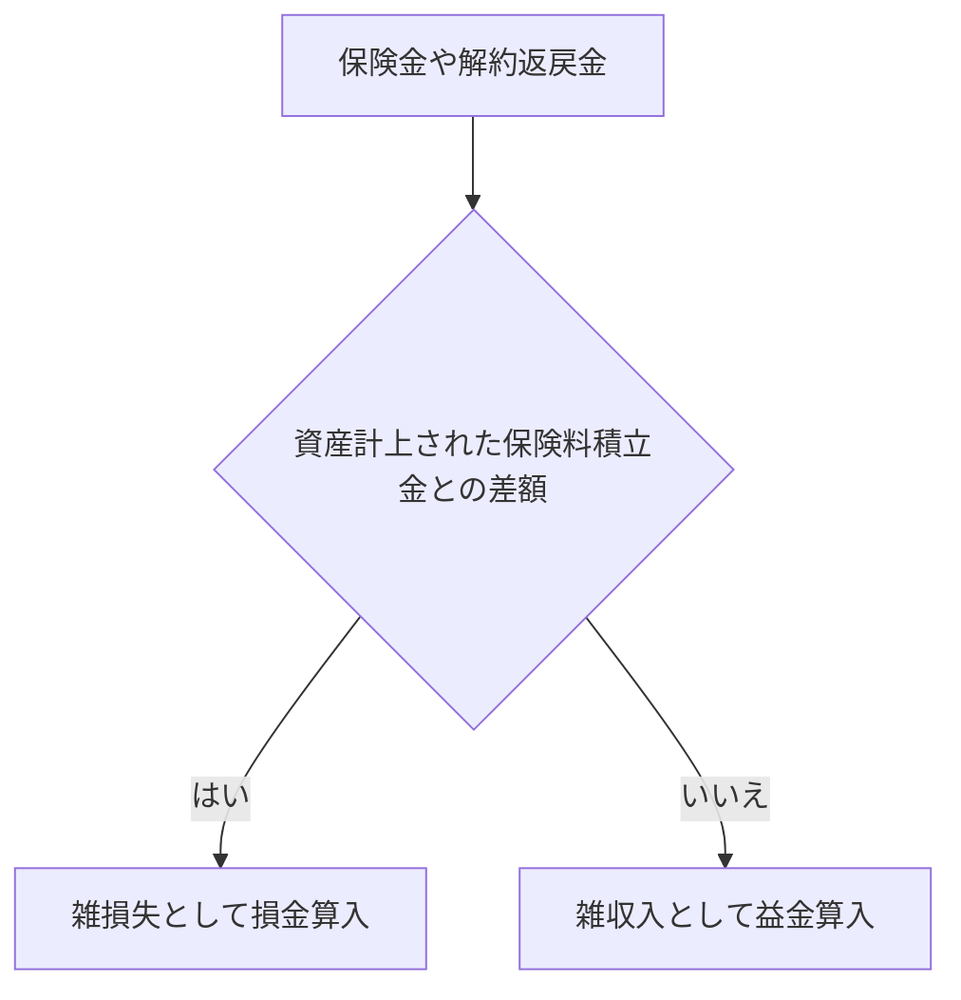

##### 【生命保険】
###### 受取人が法人の場合
保険金や解約返戻金を受け取った場合、
資産計上された保険料積立金を取り崩し、
差額を
雑損失として損金算入
または
雑収入として益金算入

###### 受取人が従業員や遺族の場合
資産計上した保険料は損金算入[^1]
[^1]: 個人事業主が受け取った場合は[[一時所得]]

##### 【火災保険】
###### 受取人が法人の場合
[[圧縮記帳]]が可能
