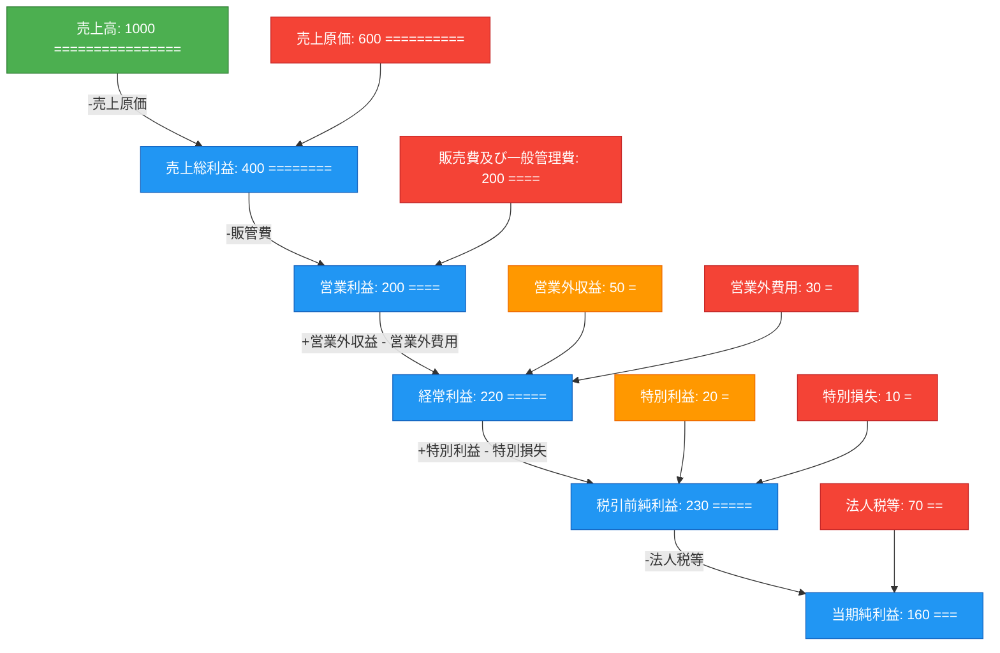

企業の経営成績を評価する資料
[[売上原価]]
[[営業利益]]
[[経常利益]]

```mermaid
graph TD

A[売上高: 1000 ================] -->| -売上原価| C[売上総利益: 400 ========]

B[売上原価: 600 ==========] --> C

C -->| -販管費| E[営業利益: 200 ====]

D[販売費及び一般管理費: 200 ====] --> E

E -->| +営業外収益 - 営業外費用| I[経常利益: 220 =====]

F[営業外収益: 50 =] --> I

G[営業外費用: 30 =] --> I

I -->| +特別利益 - 特別損失| K[税引前純利益: 230 =====]

J[特別利益: 20 =] --> K

L[特別損失: 10 =] --> K

K -->| -法人税等| N[当期純利益: 160 ===]

M[法人税等: 70 ==] --> N

  

%% スタイルの適用（インフォグラフィック風）

classDef revenue fill:#4CAF50,stroke:#2E7D32,color:#fff;

classDef cost fill:#F44336,stroke:#C62828,color:#fff;

classDef profit fill:#2196F3,stroke:#1565C0,color:#fff;

classDef special fill:#FF9800,stroke:#EF6C00,color:#fff;

  

class A revenue;

class B,D,G,L,M cost;

class C,E,I,K,N profit;

class F,J special;
```

