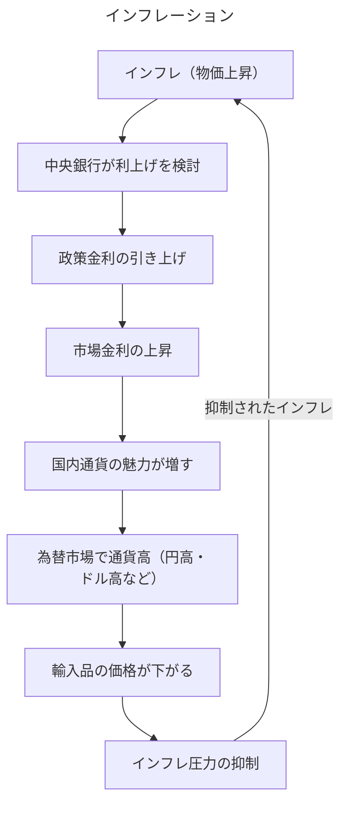

#定義 
物価が継続的に==上昇==
通貨の流通が==加速==し価値が==低下==
政策金利引き上げによる金利の==上昇==

類似 : [[デフレーション]]

## インフレーションが市場金利に与える影響（ステップ解説）

インフレーションは、以下のようなプロセスを経て市場金利の上昇圧力となります。

1.  **実質金利の低下:**
    インフレーション（物価上昇）が起こると、お金の価値が実質的に目減りします。名目上の金利が同じでも、インフレ率を差し引いた「実質金利」は低下します。
    （実質金利 ≈ 名目金利 - 期待インフレ率）

2.  **中央銀行の金融引締め:**
    行き過ぎたインフレを抑制するため、[[日銀]]などの中央銀行は[[金融引締め]]政策をとります。具体的には、政策金利の引き上げ（利上げ）を実施します。

3.  **短期市場金利の上昇:**
    中央銀行が政策金利を引き上げると、銀行間の資金の貸し借りが行われる短期金融市場の金利（例：[[無担保コール翌日物]]金利）が直接的に上昇します。

4.  **長期市場金利の上昇:**
    - **将来の金融政策への期待:** 市場参加者は、中央銀行が将来にわたってインフレ抑制のために高金利政策を続けると予想します。
    - **インフレプレミアム:** 貸し手は、将来インフレでお金の価値が下がるリスクを補うため、より高い金利（インフレプレミアム）を要求するようになります。
    これらの要因が組み合わさり、国債などの長期金利も上昇します。

5.  **預金・貸出金利への波及:**
    短期・長期の市場金利が上昇すると、それを基準に決定される金融機関の預金金利や企業・個人への貸出金利も連動して上昇します。

このように、インフレーションは中央銀行の金融政策と市場参加者の期待を通じて、市場金利全体を押し上げる方向に作用します。

[[デマンドプルインフレ]]
[[コストプッシュインフレ]]

景気拡大
→[[債券]]は固定金利
→アンダーパー発行で需要を募る
→株価は相対的に需要が上昇