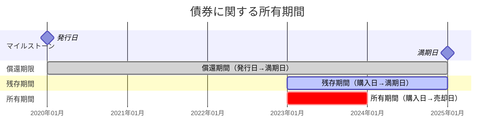

```mermaid
gantt
    title 債券に関する所有期間
    dateFormat  YYYY-MM-DD
    axisFormat  %Y年%m月

    section マイルストーン
    発行日                            :milestone, m1, 2020-01-01, 0d
    満期日                            :milestone, m2, 2025-01-01, 0d

    section 償還期限
    償還期間（発行日→満期日）         :done, a1, 2020-01-01, 2025-01-01

    section 残存期間
    残存期間（購入日→満期日）         :active, a2, 2023-01-01, 2025-01-01

    section 所有期間
    所有期間（購入日→売却日）         :crit, a3, 2023-01-01, 2024-01-01


```

