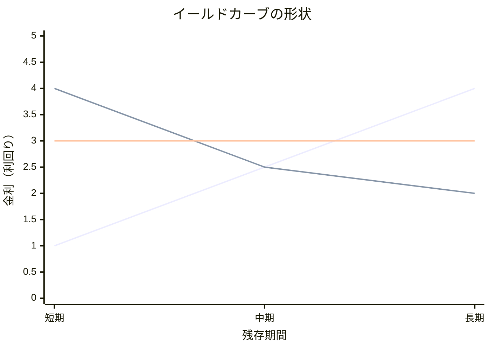

利回り曲線

縦軸に金利（利回り）、横軸に債券の残存期間（満期までの期間）としたグラフ
将来の景気や金利水準に対する市場参加者の期待を反映した[[先行指数]]


## 順イールド

短期金利よりも長期金利の方が高い状態。イールドカーブは右上がりの曲線を描く。

- **状態:** 通常時の状態。
- **市場心理:** 将来、景気が拡大し、インフレが進むことで、中央銀行が金融引締め（利上げ）を行うと市場が予想していることを示す。貸し手は、将来のインフレリスクや金利上昇リスクを織り込むため、期間が長いほど高い金利を要求する。

```mermaid
xychart-beta
  title "イールドカーブの形状"
  x-axis "残存期間" ["短期", "中期", "長期"]
  y-axis "金利（利回り）" 0 --> 5
  line "順イールド" [1, 2.5, 4]
```

## 逆イールド

短期金利が長期金利を上回る状態。イールドカーブは右下がりの曲線を描く。

- **状態:** 異例な状態。
- **市場心理:** 将来、景気が後退（リセッション）し、中央銀行が金融緩和（利下げ）に転じると市場が強く予想していることを示す。景気後退の懸念から、投資家は安全資産である長期債に資金を移動させるため、長期債の価格が上昇し、利回りが低下する。景気後退のシグナルとして非常に重要視される。

```mermaid
xychart-beta
  title "イールドカーブの形状"
  x-axis "残存期間" ["短期", "中期", "長期"]
  y-axis "金利（利回り）" 0 --> 5
  line "逆イールド" [4, 2.5, 2]

```


## スティープ化
長期金利が上昇して順イールドの長短金利差が拡大すること
```mermaid
xychart-beta
  title "イールドカーブの形状"
  x-axis "残存期間" ["短期", "中期", "長期"]
  y-axis "金利（利回り）" 0 --> 5
  line "フラット" [3, 3, 3]
```


## フラット化

短期金利と長期金利の差（長短金利差）が縮小し、イールドカーブが平坦に近づくこと。順イールドから逆イールドへ、またはその逆へ移行する過程で見られる。

```mermaid
xychart-beta
  title "イールドカーブの形状"
  x-axis "残存期間" ["短期", "中期", "長期"]
  y-axis "金利（利回り）" 0 --> 5
  line "フラット" [3, 3, 3]
```

---

## イールドカーブの形状（Mermaidグラフ）




[[ロールダウン]]効果