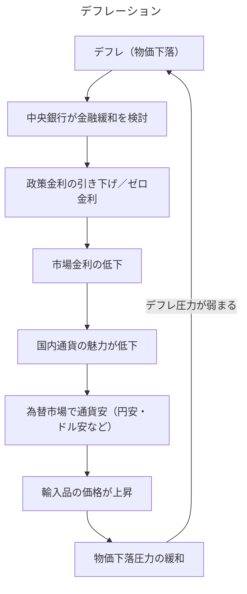

#定義 
物価が継続的に==下落==
通貨の流通が==原則==し価値が==上昇==

類似 : [[インフレーション]]

```mermaid
---
title: デフレーション 
---
graph TD
    A[デフレ（物価下落）] --> B[中央銀行が金融緩和を検討]
    B --> C[政策金利の引き下げ／ゼロ金利]
    C --> D[市場金利の低下]
    D --> E[国内通貨の魅力が低下]
    E --> F[為替市場で通貨安（円安・ドル安など）]
    F --> G[輸入品の価格が上昇]
    G --> H[物価下落圧力の緩和]

    %% 補足ループ
    H -->|デフレ圧力が弱まる| A

```