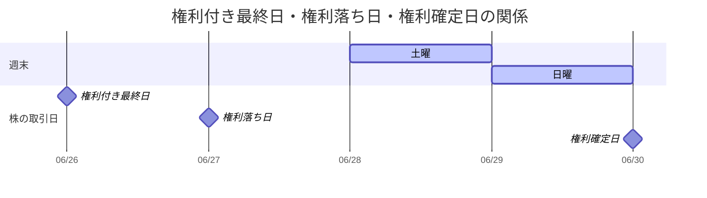

権利確定日(決算日)の==2営業日前==

```mermaid
gantt
    title 権利付き最終日・権利落ち日・権利確定日の関係
    dateFormat  YYYY-MM-DD
    axisFormat  %m/%d
    tickInterval 1day
    
	section 週末
    土曜         :active, sat, 2025-06-28, 1d
    日曜         :active, sun, 2025-06-29, 1d

    section 株の取引日
    権利付き最終日     :milestone, exdate, 2025-06-26, 0d
    権利落ち日         :milestone, xd, 2025-06-27, 0d
    権利確定日         :milestone, record, 2025-06-30, 0d


```
