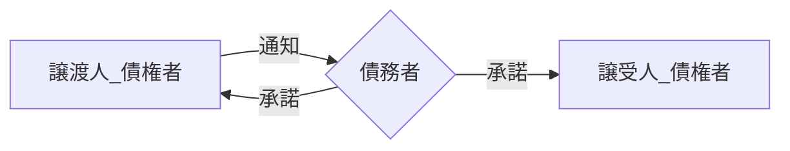

---
tags:
- 宅建
---
債権譲渡における譲受人が債権について債務者へ対抗するためには以下のいずれかが必要
いずれも口頭でも対抗可能

1. 譲渡人から債務者への通知
2. 債務者から譲渡人への承諾
3. 債務者から譲受人への承諾

```mermaid
graph LR 
A[譲渡人_債権者] -- 通知 --> B{債務者}
B -- 承諾 --> A

B -- 承諾 --> C[譲受人_債権者]

```
