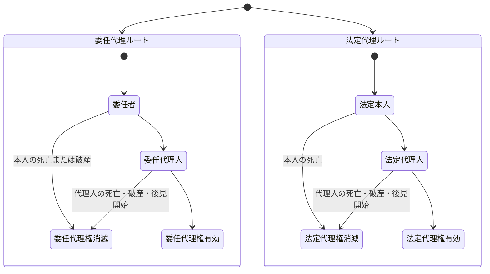

---
tags:
- 宅建
---
本人と[[代理人]]の状態によって以下の条件を満たす場合に終了する
- 本人
	- 死亡
	- 破産
		- 委任代理権のみ消滅 #間違い 
		- 法定代理権は消滅しない
- 代理人
	- 死亡
	- 破産
	- 後見開始の審判

```mermaid
stateDiagram-v2
    [*] --> 委任代理ルート
    [*] --> 法定代理ルート

    state 委任代理ルート {
        [*] --> 委任者
        委任者 --> 委任代理人
        委任者 --> 委任代理消滅 : 本人の死亡または破産
        委任代理人 --> 委任代理有効
        委任代理人 --> 委任代理消滅 : 代理人の死亡・破産・後見開始
    }

    state 法定代理ルート {
        [*] --> 法定本人
        法定本人 --> 法定代理人
        法定本人 --> 法定代理消滅 : 本人の死亡
        法定代理人 --> 法定代理有効
        法定代理人 --> 法定代理消滅 : 代理人の死亡・破産・後見開始
    }

    state "委任者" as 委任者
    state "委任代理人" as 委任代理人
    state "法定本人" as 法定本人
    state "法定代理人" as 法定代理人
    state "委任代理権消滅" as 委任代理消滅
    state "法定代理権消滅" as 法定代理消滅
    state "委任代理権有効" as 委任代理有効
    state "法定代理権有効" as 法定代理有効


```

> [!NOTE]
> [[不動産登記]]の[[代理権]]は本人が死亡しても消滅しない

