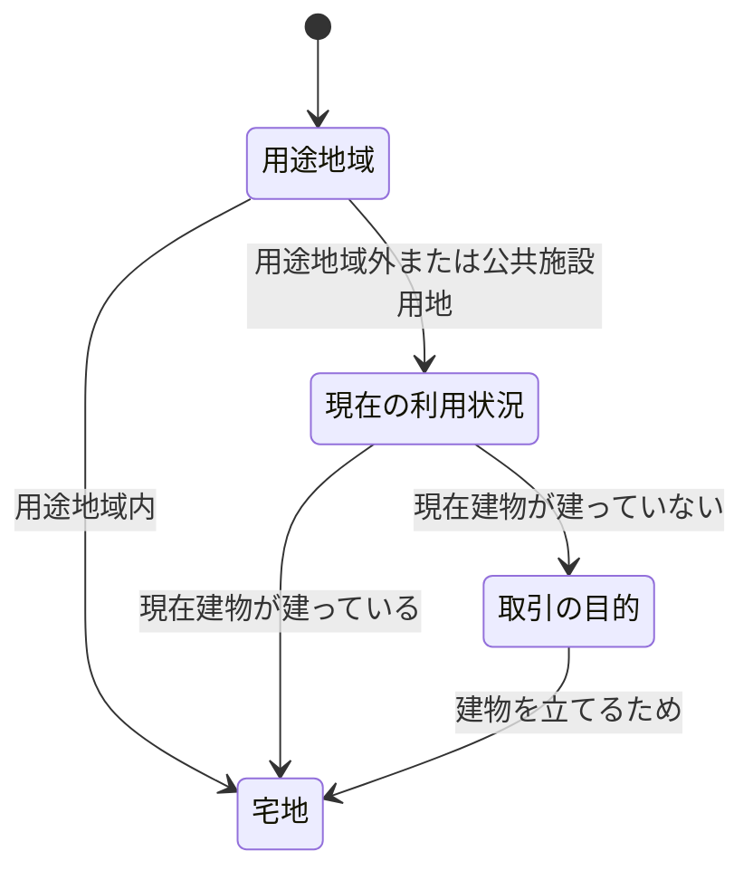

---
tags:
- 宅建
---
#定義 

以下の土地
- 今現在建物が立っている土地
- 建物を立てる目的で取引される土地
- [用途地域](用途地域.md)内の土地(道路・公園等の[公共施設地](公共施設地.md)は除く)
	- 用途地域内であれば駐車場や農地も宅地となる 

> [!NOTE]
> [登記簿の地目](地目.md)は関係ない

> [!NOTE]
> 以下は対象外
> - 水路
> - 公園
> - 広場
> - 道路