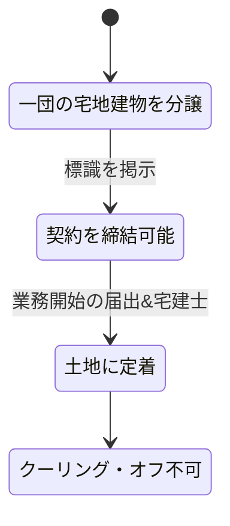

---
tags:
- 宅建
---
常設でない[[不動産業施設]]

【[[一団の宅地建物]]分譲の必要要件】
- 案内所[[標識]]を掲示[^1]
[^1]: 報酬額[[標識]]は不要

【契約または申込みの必要要件】
- 業務開始の届出
	- 免許権者および現地知事 #間違い 
	- ==10日前== #間違い 
- 宅地建物取引士(１人)
	- 成年
	- 専任

```mermaid

stateDiagram-v2
    [*] --> 一団の宅地建物を分譲
    一団の宅地建物を分譲 --> 契約を締結可能 : 標識を掲示

    契約を締結可能 --> 土地に定着 : 業務開始の届出&宅建士

    土地に定着 --> クーリング・オフ不可 

```

