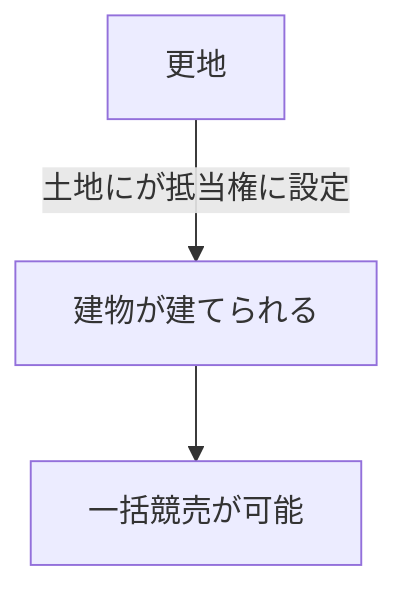

---
tags:
- 宅建
---
土地に対する債権者は以下の条件の場合、抵当権の無い建物も競売にかける事ができる。
建物の所有者に対して優先弁済を受けられるが、内容は土地に関する代金に限定される。

1. 更地に抵当権が設定される
2. 抵当権目的地に建物が建てられる

```mermaid
graph TD

更地 --> |土地にが抵当権に設定| 建物が建てられる

 建物が建てられる --> 一括競売が可能

```
