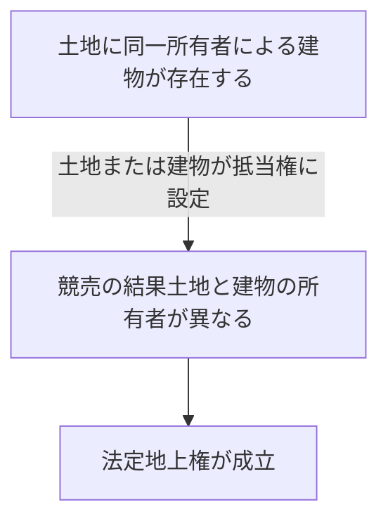

---
tags:
- 宅建
---
#定義 

以下の条件を満たすときに取得する地上権
#間違い 
1. 抵当権設定時に土地の上に建物が存在する
2. 土地と建物が抵当権設定時に同一人物の所有者であること
3. 抵当権が実行され競売の結果土地と建物の所有者が異なること

> [!NOTE] 
> 建物は無登記でも法定地上権は成立する

```mermaid
graph TD

土地に同一所有者による建物が存在する --> |土地または建物が抵当権に設定| 競売の結果土地と建物の所有者が異なる

競売の結果土地と建物の所有者が異なる --> 法定地上権が成立

```