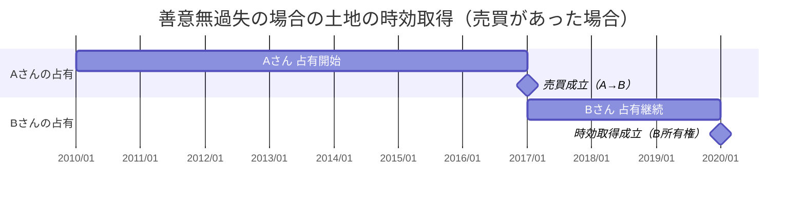

---
tags:
- 宅建
---

- [[占有]]開始時に善意無過失の場合は==10年間==
- [[占有]]開始時に悪意または有過失の場合は==20年間==
- 賃貸人も占有者とみなされる
- 売買された場合は期間を引き継ぐ
	#間違い 
	- 善意または悪意の期間設定も引き継ぐ

##### 【例】

```mermaid
gantt
    title 善意無過失の場合の土地の時効取得（売買があった場合）

    dateFormat  YYYY-MM-DD
    axisFormat  %Y/%m

    section Aさんの占有
    Aさん 占有開始         :a1, 2010-01-01, 2017-01-01


	売買成立（A→B） :milestone , 2017-01-01 

    section Bさんの占有
    Bさん 占有継続         :b2, 2017-01-02, 2020-01-01

	
	時効取得成立（B所有権）: milestone,2020-01-01
    


```

