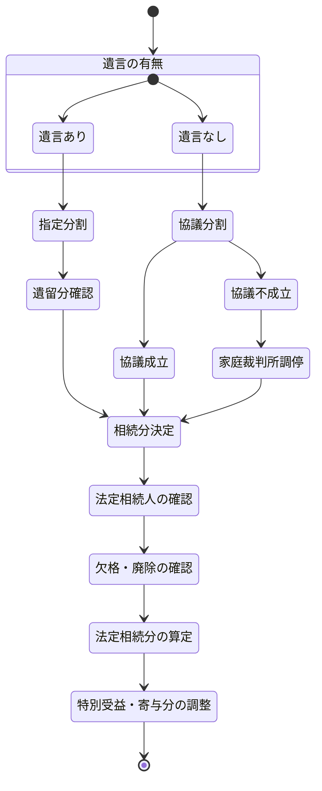

---
tags:
- 宅建
---

##### 【分割方法】
以下に分類される
- [[現物分割]]
- [[換価分割]]
- [[代償分割]]

##### 【分割協議】

[^1]

```mermaid
stateDiagram-v2
    [*] --> 遺言の有無

    state 遺言の有無 {
        [*] --> 遺言あり
        [*] --> 遺言なし
    }

    遺言あり --> 指定分割
    指定分割 --> 遺留分確認
    遺留分確認 --> 相続分決定

    遺言なし --> 協議分割
    協議分割 --> 協議成立
    協議分割 --> 協議不成立
    協議成立 --> 相続分決定
    協議不成立 --> 家庭裁判所調停
    家庭裁判所調停 --> 相続分決定

    相続分決定 --> 法定相続人の確認
    法定相続人の確認 --> 欠格・廃除の確認
    欠格・廃除の確認 --> 法定相続分の算定
    法定相続分の算定 --> 特別受益・寄与分の調整
    特別受益・寄与分の調整 --> [*]

```

[^1]: 相続税納付期限までに遺産分割が確定していない場合、[[分割見込書]]を税務署へ提出することで[[小規模宅地等の相続税の課税価格の特例]]などが3年間猶予される
