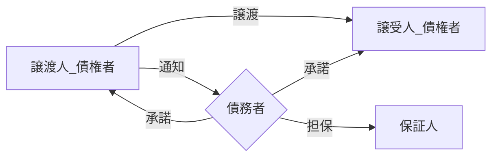

---
tags:
- 宅建
---

##### 【保証人の保護制度】[^1]
- 保証契約後の責任加重禁止
- [[催告の抗弁権]]
- [[検索の抗弁権]]
- [履行拒絶権](保証人の拒絶権.md)
- [[分別の利益]]

[^1]: [[連帯保証]]の場合は保証契約後の責任加重禁止のみ保護される

##### 【性質】
主たる債務者に対して以下の性質を持つ
- [[付従性]]
- [[随伴性]]
	主たる債務者の請求や承認による効果により保証人の事項も更新される

##### 【保証人契約】
- ==債権者==と==保証人==の間のみで契約
- ==債権者==と==保証人==との間のみ解約
	

##### 【保証人の条件】
- 債権者が保証人を指名した場合
	- 無条件
	- 変更不可
- 債務者が保証人を指名した場合
	- 弁済資力
	- [[行為能力者]]
	- 変更条件
		- 弁済資力を失った場合

##### 【債権譲渡】
[[債権譲渡の対抗要件]]を満たすことで保証人への対抗要件も成立する

##### 【主たる債務者の相殺】
- 主たる債務者が相殺する反対債権を持つ場合、債務者の意図しない弁済についての償還請求は制限され、不足分は債権者に請求する

