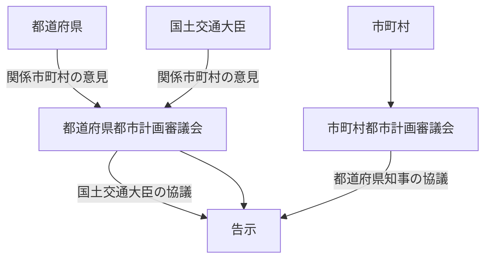

---
tags:
- 宅建
---
- [[都市計画区域]]⋯都道府県
- [[区域区分]]⋯都道府県
- 地域地区
	- [[用途地域]]
	- [[補助的地域]]地区
		- [[風致地区]]
		- [[風致地区]]以外
- [[都市施設]]
- [[地区計画]]
- [[市街地開発事業]]
	- [[非線引区域]]
	- [[市街化区域]]

- [[開発許可]]
- [[都市計画事業]]

##### 【都道府県】
公聴会
##### 【[[国土交通大臣]]】

##### 【市町村】

公聴会を任意に開催
意見書は都市計画案の縦覧期間(2週間)に提出
告示から効力を生じる