---
tags:
- 宅建
---

```mermaid
graph TD
    A(( )) --> B[地権者の相当数の同意]
    B --> C[都道府県知事に申請]
    C -->|書面提出| D{対象地域の判定}
    D -->|市街化調整区域内| E[開発審査会]
    D -->|用途地域外| F[建築確認の制限]
    E --> G[道路整備義務]
	F --> G[道路整備義務]
	D --> G[道路整備義務]
	
	G --> |書面通知|H{審査結果}
	H --> |許可|I[開発記録簿に用途を登録]
	H --> |不許可|J[審査請求]
	
	I --> K[工事]
	K --> |県知事に届出|L[工事完了検査]
	L --> M[工事完了広告]
	M --> N[予定建築物の建築]
	
	
	
	
	

    %% 開始点を黒丸にするためのスタイル
    style A fill:#000,stroke:#000,stroke-width:2px
```

以下は許可不要
- [[都市計画事業 ]] 
- 土地区画整理事業   #間違い 
- 市街地再開発事業  
- 住宅街区整備事業  
- 防災街区整備事業

開発行為申請前
- 既存公共施設の管理者
	- 協議
		- 同意
- 計画中公共施設の管理者
	- 協議

開発行為後
市町村が所有、管理

- [[開発区域]]内
	- 工事完了広告前
		- 知事の認可
		- 工事用仮設建築物
		- 土地所有者による建築物
	- 工事完了広告後
		- 知事の認可
		- [[用途地域]]が予定建築物以外
- [[開発区域]]外

[[開発許可の必要な面積]]

[[開発行為]]の変更